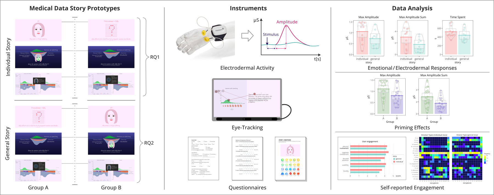
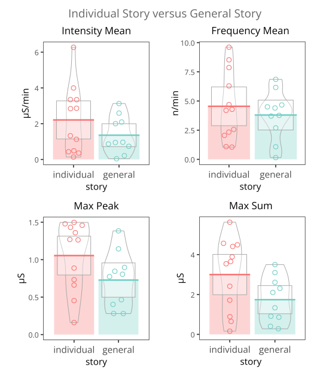
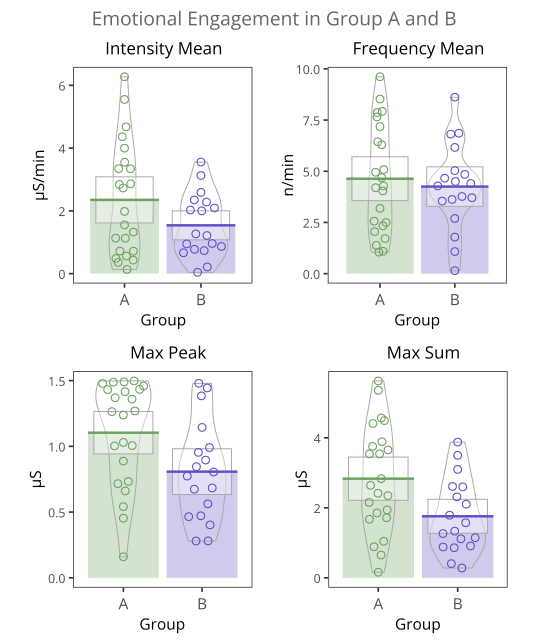
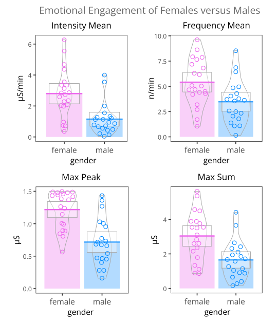
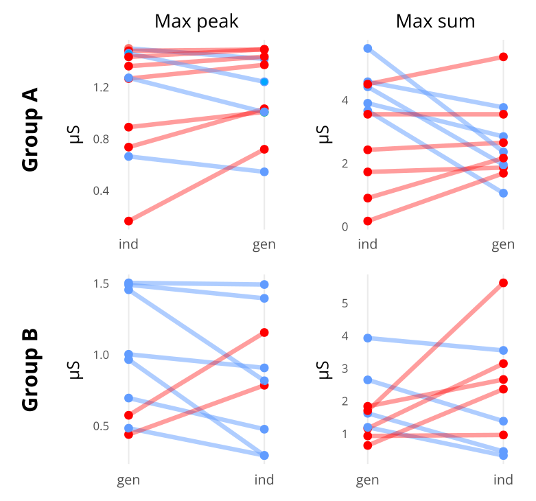
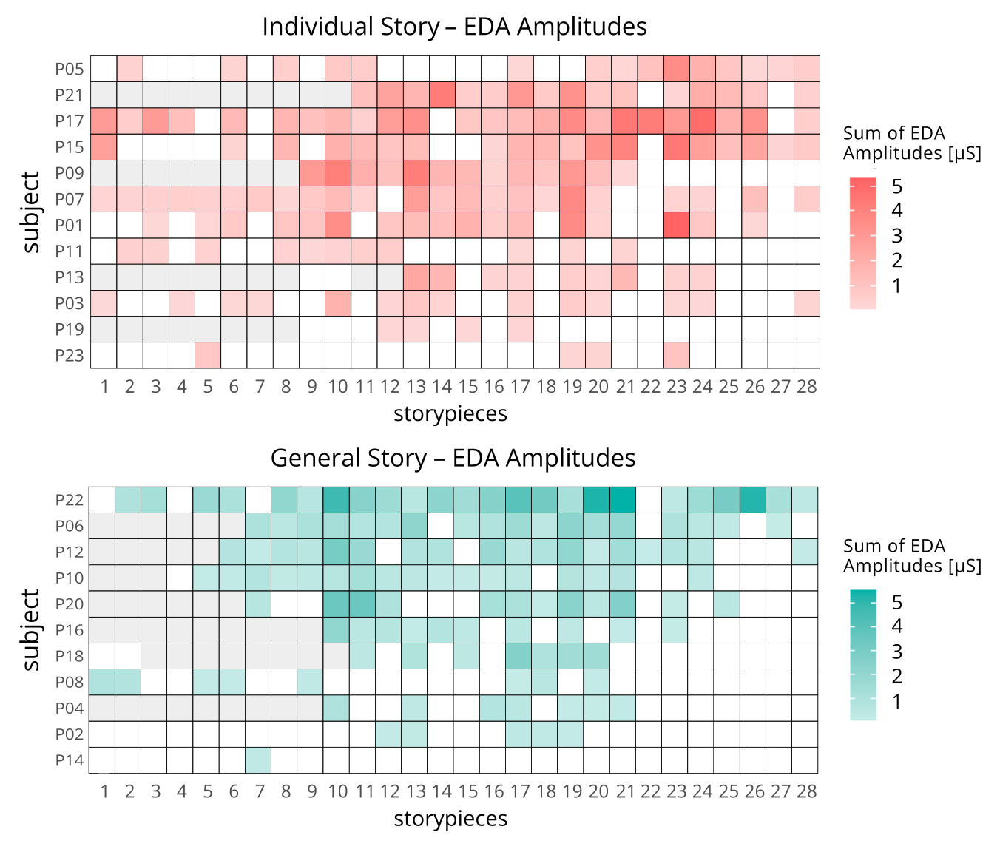
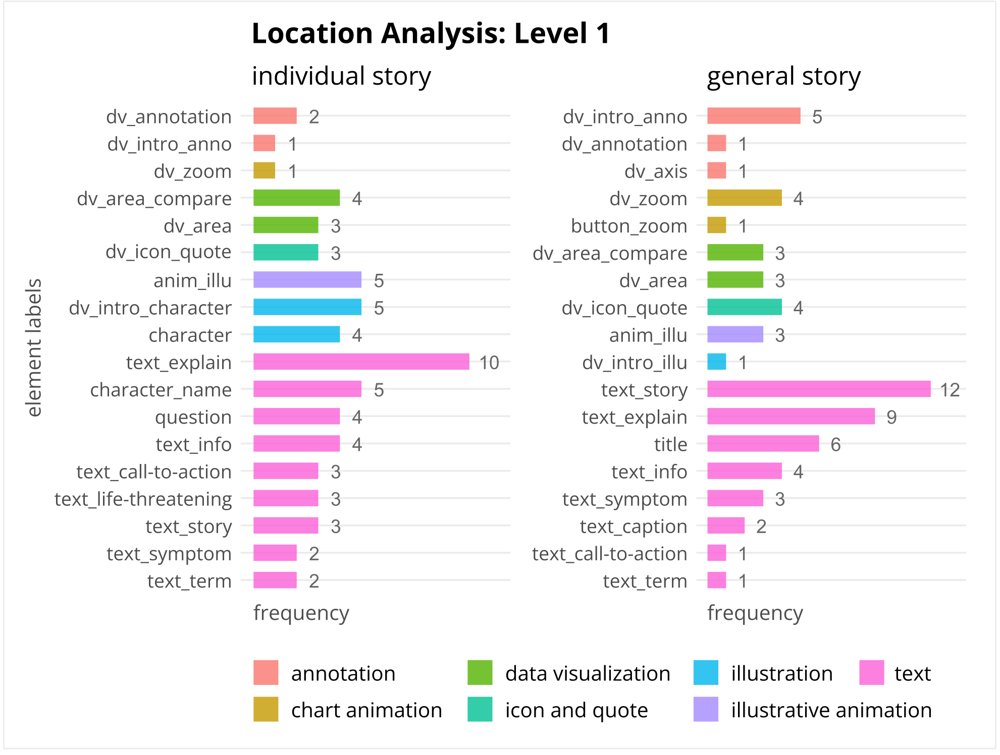
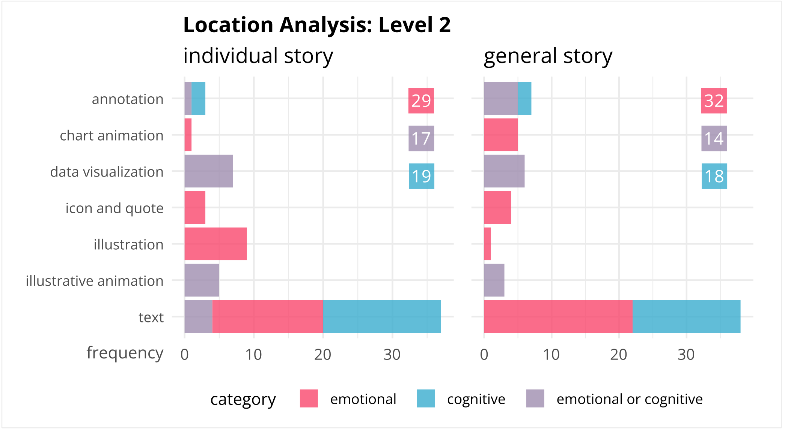
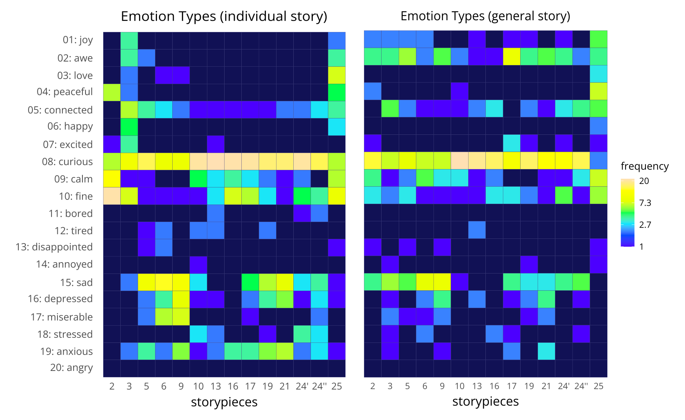
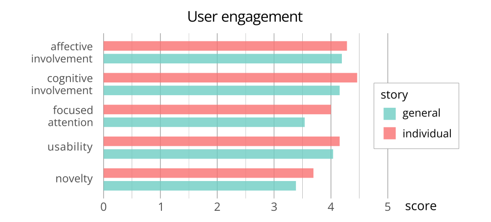

# Emotional Engagement in Narrative Medical Visualization

Quantitative analysis of electrodermal activity (EDA), eye-tracking, and questionnaire data investigating emotional engagement in narrative medical visualization.

The project analyzes physiological and behavioral responses to two interactive Hyperemesis gravidarum (HG) data stories:

- an individual character-driven narrative
- a generalized narrative perspective

The repository contains selected preprocessing workflows, statistical analysis scripts, and summary datasets related to the accompanying master’s thesis.

---

## 💡 Research Goal

This project investigates how personalization and narrative framing influence emotional engagement in medical visualization.

The study explores whether including an individual protagonist representing a patient’s lived experience increases:

- physiological arousal
- empathic emotional responses
- narrative engagement

compared to a generalized explanatory narrative.

---

## 🧪 Study Design

### Hypotheses

- H1: Including a fictitious individual protagonist increases emotional arousal.
- H2: The individual story elicits stronger negative empathic emotions.
- H3: Viewing order influences emotional engagement and physiological responses.

### Methodology



A mixed-methods study (N=26) combined:

- electrodermal activity (EDA): EdaMove 4 sensor, Software: movisens DataAnalyzer
- eye-tracking: Tobii Pro Spark sensor, Software: Tobii Pro Lab 
- questionnaires
  
to investigate emotional engagement dynamics, viewing behavior, and self-reported emotional responses.

Participants viewed two closely matched narrative visualization prototypes differing primarily in narrative framing:

- individual first-person perspective
- generalized third-person perspective

Time-resolved physiological analysis was used to identify emotionally salient story segments and visualization elements.

---

## ⚙️ Analysis Workflow

The project workflow follows four main stages:

1. data preparation
2. preprocessing and signal analysis
3. statistical evaluation
4. result visualization

### Electrodermal Activity (EDA)
- signal preprocessing and phasic signal extraction
- data quality checks and missing values handling
- peak detection
- variable computation, e.g., maximum amplitude in a story
- temporal response aggregation by story sections
- summary metric generation
- statistical hypothesis testing

### Eye-Tracking
- synchronization and labeling
- area-of-interest evaluation
- statistical hypothesis testing

### Questionnaire Analysis
- emotional valence analysis
- engagement comparison
- statistical hypothesis testing

Statistical analysis was conducted in R, depending on the data distribution and hypothesis formulation. 
The analysis used t-test, Wilcoxon test, and effect sizes such as Cohen's d or odds ratio.

---

## 📊 Repository Contents

```txt
/data
/scripts
/statistics
/results
/visualizations
```

Included:

- summary-level EDA data
- questionnaire data
- selected preprocessing scripts
- statistical analysis workflows

Not included:

- raw biometric recordings
- identifiable participant data

--- 

## 📈 Results Overview

The results indicate stronger physiological responses associated with the individual character-driven narrative, particularly in peak-based EDA measures.

Questionnaire responses further suggest increased curiosity and negative empathic emotions for the individual story version.

Participants who viewed the individual story first tended to exhibit stronger overall emotional engagement responses.

---

## 📸 Visualizations

### EDA-related plots

<table>
  <tr>
    <td align="center">
      <br>
      <sub>Story perspective</sub>
    </td>
    <td align="center">
      <br>
      <sub>Participant groups</sub>
    </td>
  </tr>

  <tr>
    <td align="center">
      <br>
      <sub>Gender differences</sub>
    </td>
    <td align="center">
      <br>
      <sub>Emotional arousal trajectories</sub>
    </td>
  </tr>
</table>

<br>

<p align="center">
  <br>
  <sub>Aggregated emotional arousal during each story piece (slide) per participant</sub>
</p>


### Eye-tracking

<table>
  <tr>
    <td align="center">
      <figure>
        
        <figcaption>Story element analysis related to the three highest EDA amplitudes per participant with detailed granularity</figcaption>
      </figure>
    </td>
    <td align="center">
      <figure> 
        
        <figcaption>Story element summary</figcaption>
      </figure>
    </td>
  </tr>
</table>

### Questionnaires

<p align="center">
  <br>
  <sub>Distribution of reported emotional response categories across story conditions</sub>
</p>

<br>

<p align="center">
  <br>
  <sub>Self-reported narrative engagement across story perspectives</sub>
</p>

---

## 🛠 Tech Stack

- Python
- R
- tidyverse ecosystem, including ggplot2
- R statistics packages, e.g., stats, effectsize

---

## 🔬 Related Work

- [Master’s Thesis PDF](https://www.vismd.de/wp-content/uploads/2026/01/Beatrice-Budich_Masters-Thesis_2025.pdf)
- [Narrative Visualization Prototype Repository](https://github.com/bbdataviz/Visualizing-Untold-Stories-Through-a-Human-Lens)

---

## 🧠 What I Learned

This project gave me practical experience with:

- synchronizing multimodal time-dependent datasets
- preprocessing and analyzing physiological sensor data
- applying statistical analysis workflows in R
- handling missing data
- visualizing experimental results using ggplot2
- designing and conducting a multimodal lab study
- evaluating emotional engagement through physiological and behavioral measures

---

## 🔒 Data & Repository Scope

Due to participant privacy considerations and ethical restrictions, this repository contains:
- summary-level biometric data
- selected preprocessing scripts
- statistical analysis workflows

Raw eye-tracking recordings, physiological recordings, and identifiable participant data are not publicly distributed.

---

## 📄 License

This project is licensed under the MIT License. Copyright (c) 2026 Beatrice Budich
